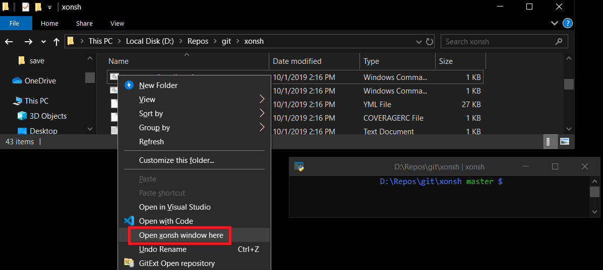

Frequently Asked Questions
==========================
Ok, so, maybe no one actually asked them.

1. Why xonsh?
-------------
The idea for xonsh first struck while I was reviewing the Bash chapter
(written by my co-author `Katy Huff <http://katyhuff.github.io/>`_)
of `Effective Computation in Physics <http://physics.codes/>`_. In the book,
we spend a bunch of time describing important, but complex ideas, such
as piping. However, we don't even touch on more 'basic' aspects of the Bash
language, such as if-statements or loops. Even though I have been using Bash
for well over a decade, I am not even sure I *know how*
to add two numbers together in it or consistently create an array. This is
normal.

If the tool is so bad, then maybe we need a new tool. So xonsh is really meant
to solve the problem that other shells don't "fit your brain."
In some programming situations this is OK because of what you get
(an optimizing compiler, type safety, provable correctness, register access).
But a shell that doesn't fit your brain is only a liability.

Coincidentally, within the week, `an article floated to the top of Hacker News <http://stephen-brennan.com/2015/01/16/write-a-shell-in-c/>`_
that teaches you how to write a shell in C. So I thought, "It can't be
that hard..."

And thus, `again <http://exofrills.org>`_, I entered the danger zone.

2. Why not another exotic shell, such as ``fish``?
-----------------------------------------------------
While many other alternative shells have an amazing suite of features
as well as much improved syntax of traditional options, none of them
are quite as beautiful as Python.  In xonsh, you get the best of all possible
worlds. A syntax that already fits your brain and any features that you
desire.

3. Why not just use the IPython command line interface?
-------------------------------------------------------
There are two serious drawbacks to this approach - though, believe me, I have
tried it.

The first is that typing ``!`` before every subprocess command is
extremely tedious.  I think that this is because it is a prefix operator and
thus gets in the way of what you are trying to do right as you start to try
to do it. Making ``!`` a postfix operator could address some of this, but
would probably end up being annoying, though not nearly as jarring.

The second reason is that tab completion of subprocess commands after an ``!``
does not work. This is a deal breaker for day-to-day use.

4. So how does this all work?
-----------------------------
We use `PLY <http://www.dabeaz.com/ply/ply.html>`_ to tokenize and parse
xonsh code. This is heavily inspired by how `pycparser <https://github.com/eliben/pycparser>`_
used this PLY. From our parser, we construct an abstract syntax tree (AST)
only using nodes found in the Python ``ast`` standard library module.
This allows us to compile and execute the AST using the normal Python tools.

Of course, xonsh has special builtins, so the proper context
(builtins, globals, and locals) must be set up prior to actually executing
any code. However, the AST can be constructed completely independently of
any context...mostly.

While the grammar of the xonsh language is context-free, it was convenient
to write the executer in a way that is slightly context sensitive. This is
because certain expressions are ambiguous as to whether they belong to
Python-mode or subprocess-mode. For example, most people will look at
``ls -l`` and see a listing command.  However, if ``ls`` and ``l`` were
Python variables, this could be transformed to the equivalent (Python)
expressions ``ls - l`` or ``ls-l``.  Neither of which are valid listing
commands.

What xonsh does to overcome such ambiguity is to check if the names in the
expression (``ls`` and ``l`` above) are in the present Python context. If they are,
then it takes
the line to be valid xonsh as written. If one of the names cannot be found,
then xonsh assumes that the left-most name is an external command. It thus
attempts to parse the line after wrapping it in an uncaptured subprocess
call ``![]``.  If wrapped version successfully parses, the ``![]`` version
stays. Otherwise, the original line is retained.

All of the context sensitive parsing occurs as an AST transformation prior to
any code is executed.  This ensures that code will never be partially executed
before failing.

It is critical to note that the context sensitive parsing is a convenience
meant for humans.  If ambiguity remains or exactness is required, simply
manually use the ``![]``, ``!()``, ``$[]`` or ``$()`` operators on your code.

5. Context-sensitive parsing is gross
--------------------------------------
Yes, context-sensitive parsing is gross. But the point of xonsh is that it uses
xontext-sensitive parsing and
is ultimately a lot less gross than other shell languages, such as Bash.
Furthermore, its use is heavily limited here.

6. My Branches are Timing Out?!
-------------------------------
Depending on you system, setup, and repository sizes, computing branch names
and colors (i.e. if the branch is dirty or not), can be a pretty slow operation.
This is bad news because xonsh can try to compute these each time it formats
the ``$PROMPT``.

In order to keep xonsh snappy, we have implemented branch computation timeouts.
This is set to a nominal value (usually 0.1 sec) via the ``$VC_BRANCH_TIMEOUT``
environment variable.

Feel free to set this to any limit that you feel comfortable with. So if you
don't mind a potentially slow prompt, set it to 1, 5, 20, 100 seconds! However,
if you never want to deal with a slow prompt or seeing this timeout message,
you can remove the ``{curr_branch}``, ``{branch_color}`` and ``{branch_bg_color}``
portions of your ``$PROMPT``, and these values will never be computed.

It is also worth noting that ``{branch_color}`` is usually the slow poke.
Just removing the color lookup from the ``$PROMPT`` can still provide the branch
name while being fast enough.

7. exec
-------
The notion of ``exec`` is a bit of a tricky beast in xonsh. Both Python and
basically every other shell language have an exec that perform radically
different operations.

* In Python, ``exec`` is a builtin function that executes strings, ASTs, or
  code objects in a provided namespace.
* In sh-langs (and elsewhere), ``exec`` is a command the runs another command
  directly in the current process.

These two ideas are central to both languages - without which most programs
cannot be run.  Luckily, even though they share a name, they have distinct
syntax and don't share a namespace.  Therefore, in xonsh,

.. code-block:: xonshcon

    # exec() as a function is run as Python's exec
    >>> exec('x = 41; x += 1', globals(), locals())

    # while exec as a statement is like bash's exec
    >>> exec gdb
    (gdb)

Yes, this is potentially confusing. This is particularly true since earlier
versions of Python *had* an exec statement whose syntax would have clashed
with the sh-lang command form.

Yes, we are sorry. But the alternative is that important programs that use
exec under the covers, such as SSH and gdb, would not be usable when xonsh
is set as the default shell. (Note that we can't rename the exec() function
since Python would fail.) As usability is the most important aspect of a shell,
xonsh trades a small amount of potential confusion for large class of important
commands.

All of the above being true, if the exec duality is causing you problems there
a few operations that you can implement to mitigate the confusion. The first is
that you can remove the ``exec`` alias and use the ``xexec`` alias instead:

.. code-block:: xonshcon

    >>> del aliases['exec']
    >>> xexec ssh

Alternatively, you can always be sure to run the exec command explicitly in
subprocess mode with ``![]`` or ``!()``:

.. code-block:: xonshcon

    >>> ![exec bash]

Lastly, you can assign the result of the exec() function to a throw away
variable (since the return is always None):

.. code-block:: xonshcon

    >>> _ = exec('x = 42')

Hopefully, though, this trade-off makes sense and you never have to worry about
it...unless chimera slaying is your bag.

8. Gotchas
----------
There are a few gotchas when using xonsh across multiple versions of Python,
where some behavior can differ, as the underlying Python might behave
differently.

For example double star globbing `**` will only work on Python 3.5+ (ie not on 3.4)
as recursive globbing is `new in Python 3.5 <https://docs.python.org/3/library/glob.html#glob.glob>`_

To keep available packages independent from underlying environments, use the provided `xpip` alias in the same way as `pip` is installed.
It will make sure that the installed packages are available to `xonsh`

9. How to add xonsh into the context menu for Windows?
------------------------------------------------------
In Windows, there's a context menu support for opening a folder in a shell, such as `Open PowerShell window here`. You might want to have a similar menu that opens a folder in xonsh:

Usually it involves modifying registry to get it, but `a contributed script <https://gist.github.com/nedsociety/91041691d0ac18bc8fd9e937ad21b055>`_ can be used for automating chores for you.

 .. code-block:: xonshcon

    # Open xonsh and copy-paste the following line:
    >>> exec(__import__('urllib.request').request.urlopen(r'https://gist.githubusercontent.com/nedsociety/91041691d0ac18bc8fd9e937ad21b055/raw/xonsh_context_menu.py').read());xonsh_register_right_click()

    # To remove the menu, use following line instead:
    >>> exec(__import__('urllib.request').request.urlopen(r'https://gist.githubusercontent.com/nedsociety/91041691d0ac18bc8fd9e937ad21b055/raw/xonsh_context_menu.py').read());xonsh_unregister_right_click()
