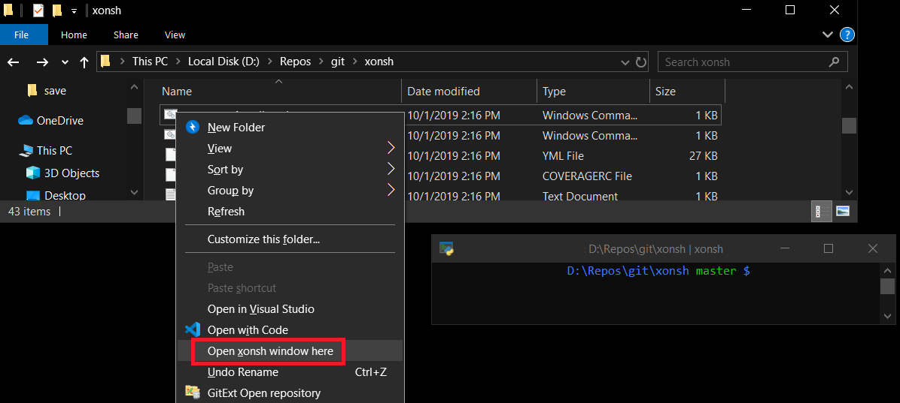
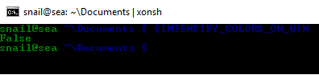

Platform-specific tips and tricks
==================================

Linux
------

Possible conflicts with Bash
^^^^^^^^^^^^^^^^^^^^^^^^^^^^^

Depending on how your installation of Bash is configured, Xonsh may show
warnings when loading certain shell modules. If you see errors similar to this
when launching Xonsh:

.. code-block:: console

    bash: module: line 1: syntax error: unexpected end of file
    bash: error importing function definition for 'BASH_FUNC_module'
    bash: scl: line 1: syntax error: unexpected end of file
    bash: error importing function definition for 'BASH_FUNC_scl'
    bash: module: line 1: syntax error: unexpected end of file
    bash: error importing function definition for 'BASH_FUNC_module'
    bash: scl: line 1: syntax error: unexpected end of file
    bash: error importing function definition for 'BASH_FUNC_scl'

...You can correct the problem by unsetting the modules, by adding the following
lines to your ``~/.bashrc file``:

.. code-block:: console

    unset module
    unset scl

macOS, OSX
----------

Path Helper
^^^^^^^^^^^

macOS provides a `path helper
<http://www.softec.lu/site/DevelopersCorner/MasteringThePathHelper>`_,
which by default configures paths in bash and other POSIX or C  shells. Without
including these paths, common tools including those installed by Homebrew
may be unavailable. See ``/etc/profile`` for details on how it is done.
To ensure the path helper is invoked on xonsh (for all users), add the
following to ``/etc/xonsh/xonshrc``:

.. code-block:: xonshcon

    source-bash $(/usr/libexec/path_helper -s)

To incorporate the whole functionality of ``/etc/profile``:

.. code-block:: xonshcon

    source-bash --seterrprevcmd "" /etc/profile

GNU Coreutils
^^^^^^^^^^^^^

macOS ships with BSD versions of common utilities (``ls``, ``grep``, ``sed``,
etc.) which have different flags and behaviour compared to the GNU versions
found on Linux. If you work across both platforms or prefer GNU behaviour,
install GNU coreutils and grep via Homebrew:

.. code-block:: console

    @ brew install coreutils grep findutils gnu-sed gnu-tar gawk

Homebrew installs GNU tools with a ``g`` prefix (e.g. ``gls``, ``ggrep``).
To use them without the prefix, add the GNU paths to your ``$PATH`` in
``~/.xonshrc``:

.. code-block:: python

    brew_prefix = $(brew --prefix).strip()
    gnu_paths = [
        f"{brew_prefix}/opt/coreutils/libexec/gnubin",
        f"{brew_prefix}/opt/grep/libexec/gnubin",
        f"{brew_prefix}/opt/findutils/libexec/gnubin",
        f"{brew_prefix}/opt/gnu-sed/libexec/gnubin",
        f"{brew_prefix}/opt/gnu-tar/libexec/gnubin",
    ]
    for p in gnu_paths:
        if @.imp.os.path.isdir(p):
            $PATH.insert(0, p)

After this, ``ls``, ``grep``, ``sed``, etc. will be the GNU versions.

Tab completion
^^^^^^^^^^^^^^

First of all take a look `xontrib-fish-completer <https://github.com/xonsh/xontrib-fish-completer>`_ for a modern approach.

Xonsh has support for using bash completion files on the shell, to use it you need to install
the bash-completion package.
The regular bash-completion package uses v1 which mostly works, but `occasionally has rough edges <https://github.com/xonsh/xonsh/issues/2111>`_ so we recommend using bash-completion v2.

Bash completion comes from <https://github.com/scop/bash-completion> which suggests you use a package manager to install it, this manager will also install a new version of bash without affecting  /bin/bash. Xonsh also needs to be told where the bash shell file that builds the completions is, this has to be added to $BASH_COMPLETIONS. The package includes completions for many Unix commands.

Common packaging systems for macOS include

 -  Homebrew where the bash-completion2 package needs to be installed.

    .. code-block:: console

       @ brew install bash-completion2

    This will install the bash_completion file in `/usr/local/share/bash-completion/bash_completion` which is in the current xonsh code and so should just work.

 - `MacPorts <https://trac.macports.org/wiki/howto/bash-completion>`_ where the bash-completion port needs to be installed.

   .. code-block:: console

    @ sudo port install bash-completion

   This includes a bash_completion file that needs to be added to the environment.

   .. code-block:: console

    @ $BASH_COMPLETIONS.insert(0, '/opt/local/share/bash-completion/bash_completion')

Note that the `bash completion project page <https://github.com/scop/bash-completion>`_ gives the script to be called as in .../profile.d/bash_completion.sh which will the call the script mentioned above and one in $XDG_CONFIG_HOME . Currently xonsh seems only to be able to read the first script directly.

Windows
-------

Windows Terminal
^^^^^^^^^^^^^^^^

If you are running a supported version of Windows (which is now Windows 10, version 2004 or later),
we recommend the Windows Terminal (``wt.exe``) rather than the time-honored ``cmd.exe``.  This provides
unicode rendering, better ansi terminal compatibility and all the conveniences you expect
from the terminal application in other platforms.

You can install it from the `Microsoft Store <https://www.microsoft.com/en-us/p/windows-terminal/9n0dx20hk701>`_
or from `Github <https://github.com/microsoft/terminal>`_.

By default Windows Terminal runs Powershell, but you can add a profile tab to run Xonsh and even configure it
to open automatically in xonsh. Here is a sample settings.json:

.. code-block::

    {
        "$schema": "https://aka.ms/terminal-profiles-schema",

        "defaultProfile": "{61c54bbd-c2c6-5271-96e7-009a87ff44bf}",

        // To learn more about global settings, visit https://aka.ms/terminal-global-settings
        // To learn more about profiles, visit https://aka.ms/terminal-profile-settings
        "profiles":
        {
            "defaults":
            {
                // Put settings here that you want to apply to all profiles.
            },
            "list":
            [
                {
                    // Guid from https://guidgen.com
                    "guid": "{02639f1c-9437-4b34-a383-2df49b5ed5c5}",
                    "name": "Xonsh",
                    "commandline": "c:\\users\\bobhy\\src\\xonsh\\.venv\\scripts\\xonsh.exe",
                    "hidden": false
                },
                {
                    // Make changes here to the powershell.exe profile.
                    "guid": "{61c54bbd-c2c6-5271-96e7-009a87ff44bf}",
                    "name": "Windows PowerShell",
                    "commandline": "powershell.exe",
                    "hidden": false
                }
            ]
        },

        . . .

How to add xonsh into the context menu for Windows?
^^^^^^^^^^^^^^^^^^^^^^^^^^^^^^^^^^^^^^^^^^^^^^^^^^^

In Windows, there's a context menu support for opening a folder in a shell, such as `Open PowerShell window here`. You might want to have a similar menu that opens a folder in xonsh:

Usually it involves modifying registry to get it, but `a contributed script <https://gist.github.com/nedsociety/91041691d0ac18bc8fd9e937ad21b055>`_ can be used for automating chores for you.

 .. code-block:: xonshcon

    # Open xonsh and copy-paste the following line:
    @ exec(__import__('urllib.request').request.urlopen(r'https://gist.githubusercontent.com/nedsociety/91041691d0ac18bc8fd9e937ad21b055/raw/xonsh_context_menu.py').read());xonsh_register_right_click()

    # To remove the menu, use following line instead:
    @ exec(__import__('urllib.request').request.urlopen(r'https://gist.githubusercontent.com/nedsociety/91041691d0ac18bc8fd9e937ad21b055/raw/xonsh_context_menu.py').read());xonsh_unregister_right_click()

Nice colors
^^^^^^^^^^^

The dark red and blue colors are completely unreadable in `cmd.exe`.

Xonsh has some tricks to fix colors. This is controlled by the
:ref:`$INTENSIFY_COLORS_ON_WIN <intensify_colors_on_win>`
environment variable which is ``True`` by default.

:ref:`$INTENSIFY_COLORS_ON_WIN <intensify_colors_on_win>` has the following effect:b

On Windows 10:
    Windows 10 supports true color in the terminal, so on Windows 10 Xonsh will use
    a style with hard coded colors instead of the terminal colors.

On older Windows:
    Xonsh replaces some of the unreadable dark colors with more readable
    alternatives (e.g. blue becomes cyan).

Avoid locking the working directory
^^^^^^^^^^^^^^^^^^^^^^^^^^^^^^^^^^^

Python (like other processes on Windows) locks the current working directory so
it can't be deleted or renamed. ``cmd.exe`` has this behaviour as well, but it
is quite annoying for a shell.

The :ref:`free_cwd <free_cwd>` xontrib (add-on) for xonsh solves some of this problem. It
works by hooking the prompt to reset the current working directory to the root
drive folder whenever the shell is idle. It only works with the prompt-toolkit
back-end. To enable that behaviour run the following:

.. code-block:: xonshcon

   @ xpip install xontrib-free-cwd

Add this line to your ``~/.xonshrc`` file to have it always enabled.

.. code-block:: xonshcon

   @ xontrib load free_cwd

Name space conflicts
^^^^^^^^^^^^^^^^^^^^^^^

Due to ambiguity with the Python ``dir`` builtin, to list the current directory
you must explicitly request the ``.`` or set ``$XONSH_BUILTINS_TO_CMD``.

Many people create a ``d`` alias for the ``dir`` command to save
typing and avoid the ambiguity altogether:

.. code-block:: xonshcon

   @ aliases['d'] = ['cmd', '/c', 'dir']

You can add aliases to your `xonshrc <xonshrc.rst>`_ to have it always
available when xonsh starts.

Alternatively, the experimental ``$XONSH_BUILTINS_TO_CMD`` setting makes bare
Python builtin names (``dir``, ``zip``, ``type``, etc.) run as subprocess
commands when a matching alias or executable exists:

.. code-block:: xonshcon

    @ $XONSH_BUILTINS_TO_CMD = True
    @ dir
     Volume in drive C is Windows
     ...

Working Directory on PATH
^^^^^^^^^^^^^^^^^^^^^^^^^

Windows users, particularly those coming from the ``cmd.exe`` shell,
might be accustomed to being able to run executables from the current
directory by simply typing the program name.

Since version 0.16, ``xonsh`` follows the more secure and modern
approach of not including the current working directory in the search
path, similar to Powershell and popular Unix shells. To invoke commands
in the current directory on any platform, include the current directory
explicitly:

.. code-block:: xonshcon

    @ ./my-program

Although not recommended, to restore the behavior found in the
``cmd.exe`` shell, simply append ``.`` to the ``PATH``:

.. code-block:: xonshcon

    @ $PATH.append('.')

Add that to ``~/.xonshrc`` to enable that as the default behavior.

Commands Cache
^^^^^^^^^^^^^^

Windows filesystem access can be slow, especially on network drives or
directories like ``C:\Windows\System32`` with thousands of executables. Xonsh
scans ``$PATH`` directories to resolve commands, which may cause noticeable
lag.

The ``$XONSH_COMMANDS_CACHE_READ_DIR_ONCE`` variable tells xonsh to cache
directory listings on first access and never re-read them within the session.
On Windows it defaults to ``C:\Windows`` (via ``%WINDIR%``), meaning
``C:\Windows\System32`` and all other subdirectories are scanned once and
cached for the rest of the session. You can extend it with additional slow
directories:

.. code-block:: xonshcon

    @ $XONSH_COMMANDS_CACHE_READ_DIR_ONCE += ['C:\\Program Files', 'C:\\Program Files (x86)']

On WSL, xonsh auto-detects ``/mnt/*/Windows`` directories.

To debug command resolution, enable:

.. code-block:: xonshcon

    @ $XONSH_COMMANDS_CACHE_DEBUG = True

See Also
-----------

 - `Bash to Xonsh <bash_to_xsh.html>`_
