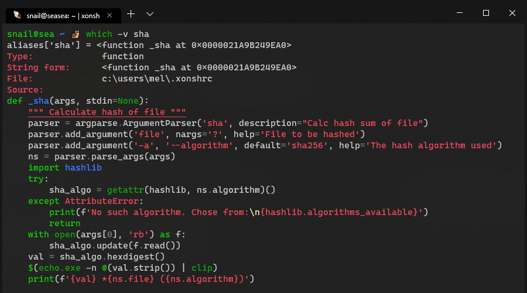
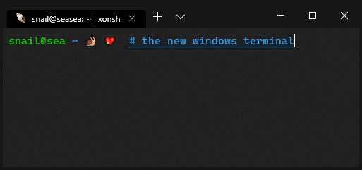

==========================
Windows Guide
==========================

Installation
================

The easy way
----------------

The easiest way to install xonsh on windows is through the `Anaconda Python
Distribution <https://www.anaconda.com/download/>`__ and the conda package manager.

.. note::

    Xonsh is not supported on legacy Python (2.7).

Install xonsh with the following command:

.. code-block:: bat

   > conda config --add channels conda-forge
   > conda install xonsh

This will install xonsh and all the recommended dependencies. Next, run xonsh:

.. code-block:: bat

   > xonsh
   snail@home ~ $

Install from source
-------------------

To install xonsh from source on Windows, first install `Python v3.4+`_ from
http://python.org. Remember to select "Add python to PATH" during installation.

Next, install the prompt_toolkit dependency via ``pip``:

.. code-block:: bat

   > pip install prompt-toolkit

Download the latest `xonsh-master.zip`_ from github and unzip it
to ``xonsh-master``.

Now install xonsh:

.. code-block:: bat

   > cd xonsh-master
   > python setup.py install

Next, run xonsh:

.. code-block:: bat

  > xonsh
  snail@home ~ $

.. _Python v3.4+: https://www.python.org/downloads/windows/
.. _xonsh-master.zip: https://github.com/xonsh/xonsh/archive/master.zip
.. _cmder: http://cmder.net/
.. _conemu: https://conemu.github.io/

Tips and Tricks
================

Nice colors
----------------------

The dark red and blue colors are completely unreadable in Windows' default
terminal.

.. image:: _static/intensify-colors-on-win-false.png
   :width: 396 px
   :alt: intensify-colors-win-false
   :align: center

There are ways to `configure the colors`_ of the old terminal, but to give new users the
best experience Xonsh has some tricks to fix colors. This is controlled by the
:ref:`$INTENSIFY_COLORS_ON_WIN <intensify_colors_on_win>`
environment variable which is ``True`` by default. 

.. _configure the colors: https://blogs.msdn.microsoft.com/commandline/2017/08/11/introducing-the-windows-console-colortool/

:ref:`$INTENSIFY_COLORS_ON_WIN <intensify_colors_on_win>` has the following effect:b 

On Windows 10:
    Windows 10 supports true color in the terminal, so on Windows 10 Xonsh will use
    a style with hard coded colors instead of the terminal colors.

On older Windows:
    Xonsh replaces some of the unreadable dark colors with more readable
    alternatives (e.g. blue becomes cyan).

   
**The new Windows terminal**

The best option on windows is to use the new `Windows Terminal
<https://github.com/microsoft/terminal>`__ developed by Microsoft as an open
source project. The new terminal supports has many nice features including
Unicode rendering. 

It is highly recommended and can easily be `installed from the Windows Store`_:

.. _installed from the Windows Store: https://blogs.msdn.microsoft.com/commandline/2017/08/11/introducing-the-windows-console-colortool/

Avoid locking the working directory
-----------------------------------

Python (like other processes on Windows) locks the current working directory so
it can't be deleted or renamed. ``cmd.exe`` has this behaviour as well, but it
is quite annoying for a shell. 

The :ref:`free_cwd <free_cwd>` xontrib (add-on) for xonsh solves some of this problem. It
works by hooking the prompt to reset the current working directory to the root
drive folder whenever the shell is idle. It only works with the prompt-toolkit
back-end. To enable that behaviour run the following: 

Add this line to your ``~/.xonshrc`` file to have it always enabled. 

.. code-block:: xonshcon

   >>> xontrib load free_cwd

Name space conflicts
--------------------

Due to ambiguity with the Python ``dir`` builtin, to list the current directory
via the ``cmd.exe`` builtin you must explicitly request the ``.``, like this:

.. code-block:: xonshcon

   >>> dir .
    Volume in drive C is Windows
    Volume Serial Number is 30E8-8B86

    Directory of C:\Users\snail\xonsh

   2015-05-12  03:04    <DIR>          .
   2015-05-12  03:04    <DIR>          ..
   2015-05-01  01:31    <DIR>          xonsh
                  0 File(s)              0 bytes
                  3 Dir(s)  11,008,000,000 bytes free

Many people create a ``d`` alias for the ``dir`` command to save
typing and avoid the ambiguity altogether:

.. code-block:: xonshcon

   >>> aliases['d'] = ['cmd', '/c', 'dir']

You can add aliases to your ``~/.xonshrc`` to have it always
available when xonsh starts.

Unicode support for Windows
----------------------------

Python's utf-8 unicode is not compatible with the default console "conhost" on Windows.

Luckily, Microsoft is developing a new `Windows terminal <https://github.com/microsoft/terminal>`__ as an open source project. The new terminal supports all the nice features of 
that you find in linux terminals. It is highly recommended and can easily be `installed from the Windows Store`_:

