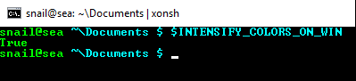
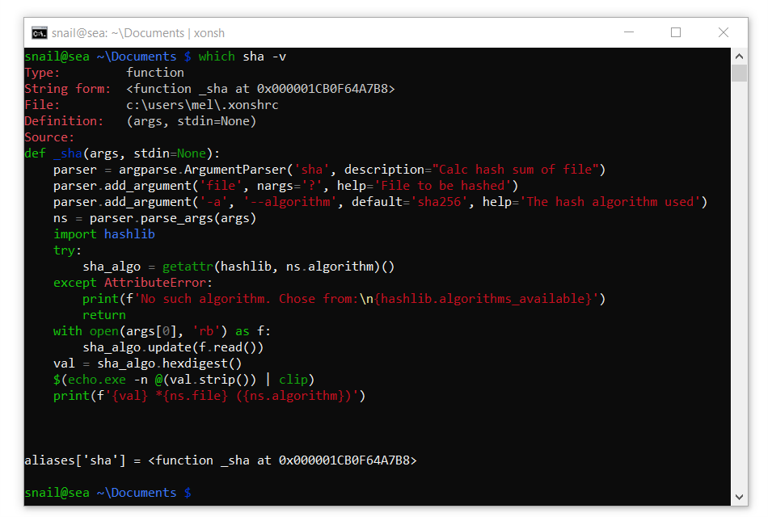

==========================
Windows Guide
==========================

Installation
================

The easy way
----------------

The easiest way to install xonsh on windows is through the Anaconda Python
Distribution and the conda package manager.

.. note::

    Be sure to install the version with Python3.4 or later.
    Xonsh is not yet supported on legacy Python (2.7).

Install xonsh with the following command:

.. code-block:: bat

   > conda config --add channels conda-forge
   > conda install xonsh

This will install xonsh and all the recommended dependencies. Next, run xonsh:

.. code-block:: bat

   > xonsh
   snail@home ~ $


Install from source
-------------------

To install xonsh from source on Windows, first install `Python v3.4+`_ from
http://python.org. Remember to select "Add python to PATH" during installation.

Next, install the prompt_toolkit dependency via ``pip``:

.. code-block:: bat

   > pip install prompt-toolkit

While prompt-toolkit is considered an optional dependency, it is the
recommended alternative to pyreadline for Windows users. For Windows,
it is recommended to use a replacement console emulator. Good choices are `cmder`_ or `conemu`_.

Download the latest `xonsh-master.zip`_ from github and unzip it
to ``xonsh-master``.

Now install xonsh:

.. code-block:: bat

   > cd xonsh-master
   > python setup.py install

Next, run xonsh:

.. code-block:: bat

  > xonsh
  snail@home ~ $

.. _Python v3.4+: https://www.python.org/downloads/windows/
.. _xonsh-master.zip: https://github.com/xonsh/xonsh/archive/master.zip
.. _cmder: http://cmder.net/
.. _conemu: https://conemu.github.io/


Usage
================

Color style
--------------------------------
The dark red and blue colors are completely unreadable in Windows' default
terminal. 

.. image:: _static/intensify-colors-on-win-false.png
   :width: 396 px
   :alt: intensify-colors-win-false
   :align: center

To give new users, the best experience Xonsh automatically replaces 
some of the dark colors with more readable alternatives (e.g. blue becomes cyan).
The behavior is controlled with the ``$INTENSIFY_COLORS_ON_WIN``
environment variable.


   
It is possible to configure the Windows console with readable default colors,
but it is tedious to do manually. Here is registry file which will do it
automatically and set some good default colors. Simply download and run the registry file. 

 * `console_colors.reg`_

 .. note:: This may not always work right away. Especially if you already fiddled around with the colors settings.
           Try to delete any subfolders under ``HKCU/console/`` in the registry. Also, shortcuts files store their own
           colors schemes and ignore registry settings.

With better colors configured, ``$INTENSIFY_COLORS_ON_WIN`` should be set to 
``False``, and the default prompt can be changed to match how it looks on POSIX and Mac.
You can do this by adding the following to the xonsh run control file ``.xonshrc``: 


.. code-block:: xonshcon

    $INTENSIFY_COLORS_ON_WIN = False
    $PROMPT = $PROMPT.replace('INTENSE_','').replace('CYAN','BLUE')

With everything setup the console will look like this:




.. _console_colors.reg: http://xon.sh/_static/console_colors.reg


Avoid locking the working directory
-----------------------------------

Python (like other processes on Windows) locks the current working directory so it can't be deleted or renamed.
``cmd.exe`` has this behaviour as well, but it quite annoying for a shell. 

There is a xontrib (``free_cwd``) for xonsh that solves some of this problem. It works by 
hooking the prompt to reset the current working directory to the root drive folder whenever
the shell is idle. To enable that behaviour run the following: 

.. code-block:: xonshcon

   >>> xontrib load free_cwd

Add this line to your ``~/.xonshrc`` file to have it always enabled. 


Name space conflicts
--------------------

Due to ambiguity with the Python ``dir`` builtin, to list the current
directory via the ``cmd.exe`` builtin you must explicitly request
the ``.``, like this:

.. code-block:: xonshcon

   >>> dir .
    Volume in drive C is Windows
    Volume Serial Number is 30E8-8B86

    Directory of C:\Users\snail\xonsh

   2015-05-12  03:04    <DIR>          .
   2015-05-12  03:04    <DIR>          ..
   2015-05-01  01:31    <DIR>          xonsh
                  0 File(s)              0 bytes
                  3 Dir(s)  11,008,000,000 bytes free


Many people create a ``d`` alias for the ``dir`` command to save
typing and avoid the ambiguity altogether:

.. code-block:: xonshcon

   >>> aliases['d'] = ['cmd', '/c', 'dir']

You can add aliases to your ``~/.xonshrc`` to have it always
available when xonsh starts.


Unicode support for Windows
----------------------------

Python's utf-8 unicode is not compatible with the default shell 'cmd.exe' on Windows. The package ``win_unicode_console`` fixes this. Xonsh will use ``win_unicode_console`` if it is installed. This can be disabled/enabled with the ``$WIN_UNICODE_CONSOLE``` environment variable.

.. note:: Even with unicode support enabled the symbols available will depend on the font used in cmd.exe.

The packages ``win_unicode_console`` can be installed along with xonsh by using the package name ``xonsh[win]`` or separately using pip or conda.

.. code-block:: bat

  > pip install win_unicode_console


.. code-block:: bat

  > conda install --channel xonsh win_unicode_console
